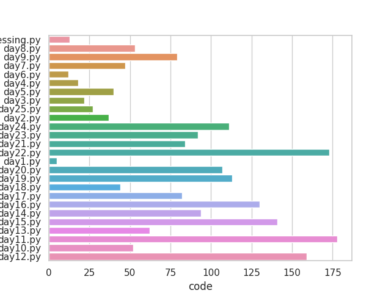

```text
    _       _                 _            __                 _      
   / \   __| |_   _____ _ __ | |_    ___  / _|   ___ ___   __| | ___ 
  / _ \ / _` \ \ / / _ \ '_ \| __|  / _ \| |_   / __/ _ \ / _` |/ _ \
 / ___ \ (_| |\ V /  __/ | | | |_  | (_) |  _| | (_| (_) | (_| |  __/
/_/   \_\__,_| \_/ \___|_| |_|\__|  \___/|_|    \___\___/ \__,_|\___|
                                                                     
 ____   ___ ____  ____  
|___ \ / _ \___ \|___ \ 
  __) | | | |__) | __) |
 / __/| |_| / __/ / __/ 
|_____|\___/_____|_____|
                        
```
****************************

****************************
```text
==============================================================================================================================================================
 Language                                                                                           Files        Lines         Code     Comments       Blanks
==============================================================================================================================================================
 Python                                                                                                26         3124         1977          846          301
--------------------------------------------------------------------------------------------------------------------------------------------------------------
 preprocessing.py                                                                                                   29           15           12            2
 day9.py                                                                                                           162           79           71           12
 day8.py                                                                                                            65           53            8            4
 day7.py                                                                                                            64           47            8            9
 day5.py                                                                                                            66           40           22            4
 day4.py                                                                                                            26           18            6            2
 day3.py                                                                                                            36           22           11            3
 day2.py                                                                                                            42           37            4            1
 day6.py                                                                                                            16           12            4            0
 day25.py                                                                                                           43           27            9            7
 day24.py                                                                                                          153          111           19           23
 day23.py                                                                                                          158           92           53           13
 day22.py                                                                                                          217          173           23           21
 day20.py                                                                                                          144          107           14           23
 day1.py                                                                                                            11            5            5            1
 day19.py                                                                                                          171          113           36           22
 day21.py                                                                                                          125           84           27           14
 day18.py                                                                                                           97           44           44            9
 day17.py                                                                                                          137           82           39           16
 day16.py                                                                                                          187          130           36           21
 day14.py                                                                                                          139           94           31           14
 day13.py                                                                                                           81           62           12            7
 day15.py                                                                                                          243          141           74           28
 day12.py                                                                                                          199          159           20           20
 day10.py                                                                                                           75           52           14            9
 day11.py                                                                                                          438          178          244           16
==============================================================================================================================================================
 Total                                                                                                 26         3124         1977          846          301
==============================================================================================================================================================
```
****************************
> This analytic is not accurate, I don't attempt to create it util the day 25. Previous day I use Pypercent file and doing thing in code block,
  so many problem can occur like code in block is conflict together, or I comment out some code, and it will not be counted.
#### Day 10: 
[Day 10](day10.py)
#### Day 11: 
[Day 11](day11.py)
#### Day 12: 
[Day 12](day12.py)
#### Day 13: 
[Day 13](day13.py)
#### Day 14: 
[Day 14](day14.py)
#### Day 15: 
[Day 15](day15.py)
#### Day 16: 
[Day 16](day16.py)
#### Day 17: 
[Day 17](day17.py)
#### Day 18: 
[Day 18](day18.py)
#### Day 19: 
[Day 19](day19.py)
#### Day 1: 
[Day 1](day1.py)
#### Day 20: 
[Day 20](day20.py)
#### Day 21: 
[Day 21](day21.py)
#### Day 22: 
[Day 22](day22.py)
#### Day 23: 
[Day 23](day23.py)
#### Day 24: 
[Day 24](day24.py)
#### Day 25: 
[Day 25](day25.py)
#### Day 2: 
[Day 2](day2.py)
#### Day 3: 
[Day 3](day3.py)
#### Day 4: 
[Day 4](day4.py)
#### Day 5: 
[Day 5](day5.py)
#### Day 6: 
[Day 6](day6.py)
#### Day 7: 
[Day 7](day7.py)
#### Day 8: 
[Day 8](day8.py)
#### Day 9: 
[Day 9](day9.py)
#### Day : 
[Day ](day.py)
